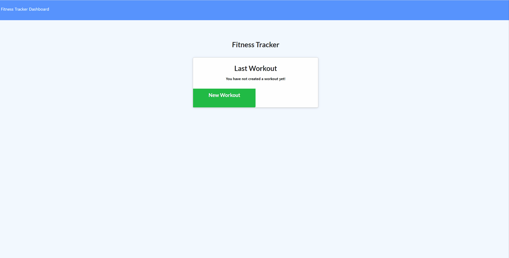
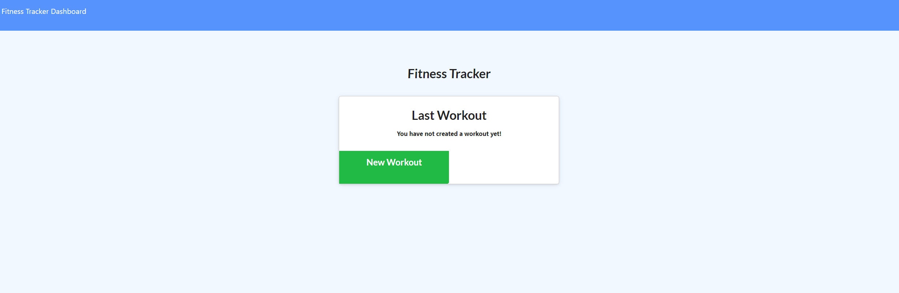

# Workout Tracker

Using Node.js, Express, MongoDb and Mongoose, users can view, create, track, and uddate thier cardio or resistance workouts.

## User Story

* As a user, I want to be able to view create and track daily workouts. I want to be able to log multiple exercises in a workout on a given day. I should also be able to track the name, type, weight, sets, reps, and duration of exercise. If the exercise is a cardio exercise, I should be able to track my distance traveled.

## Business Context

A consumer will reach their fitness goals quicker when they track their workout progress.

## Fitness Tracker Gif

## Fitness Tracker Picture

When the user loads the page, they should be given the option to create a new workout, or continue with their last workout.

The user should be able to:

* Add exercises to a previous workout plan.

* Add new exercises to a new workout plan.

* View multiple the combined weight of multiple exercises on the stats page.
